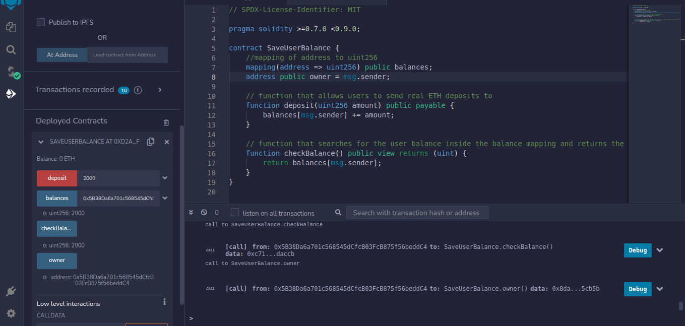

# Task - Payable

- Growic Solidity Developer Program

Smart contract that saves user balance.

This contract has function that allows users to send real ETH deposits to the contract saves the amount a user is depositing into a mapping and a function that searches for user balance inside the mapping and returns the balance of who calls the contract.

## Sample Output

